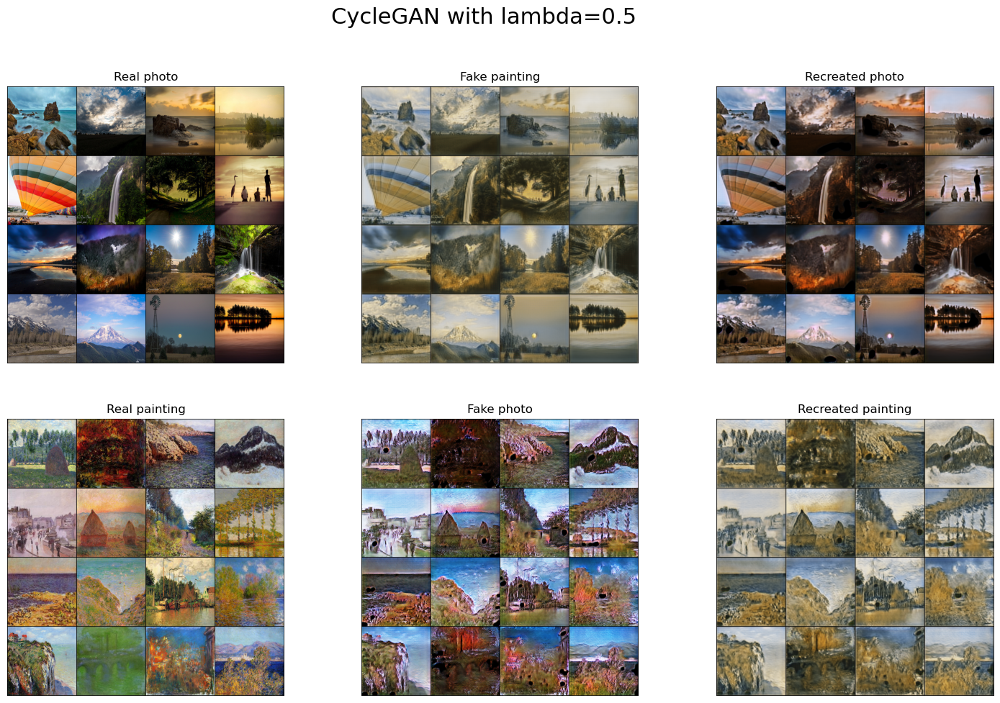
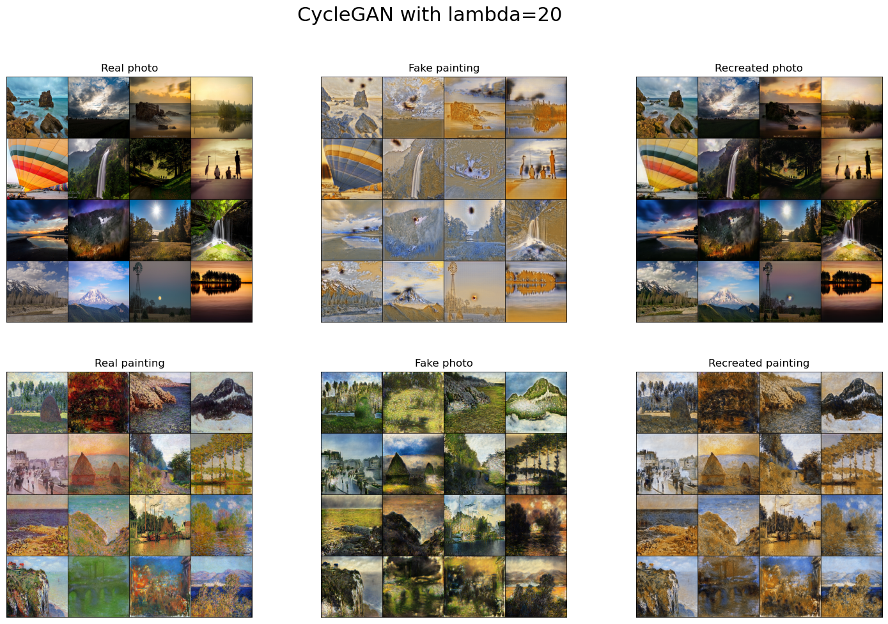
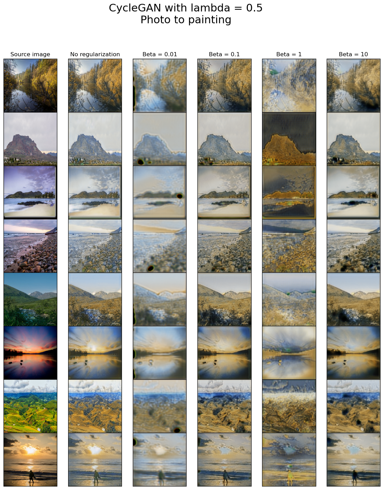
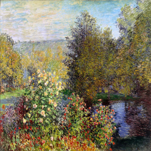
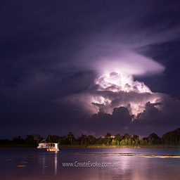
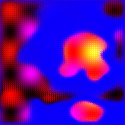
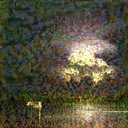

# Take control of your style - WUT-24L-ZPRP

---

<details>
  <summary><b>Table of contents</b></summary>

Table of Contents
=================

* [Description and Experiments](#description-and-experiments)
    * [What is style transfer](#what-is-style-transfer)
    * [Take control of your style](#take-control-of-your-style)
    * [How not to collapse?](#how-not-to-collapse)
    * [Comparison between cycleGAN and Gatys](#comparison-between-cyclegan-and-gatys)
    * [Disclaimer and further work](#disclaimer-and-further-work)
* [Setup](#setup)
* [Scripts](#scripts)
  * [Downloading dataset](#downloading-dataset)
  * [Download models from experiments](#download-models-from-experiments)
  * [Training Gatys](#training-gatys)
  * [Training cycleGAN](#training-cyclegan)
  * [Inference cycleGAN](#inference-cyclegan)
* [Contributing](#contributing)

</details>

## Description and Experiments

---

### What is style transfer?

This project explores concept of style transfer in computer vision using
python. Idea was proposed by [L. Gatys](https://arxiv.org/abs/1508.06576)
to apply the stylistic elements of one image are applied to the content of
another image, creating a unique blend of both like below:


### Take control of your style

One of them main issues is fact images preserved content but don't resemble
given style or are significantly styled but content is disported. To address
this issue we prosed parameter to loss function

```math
\mathcal{L}_{total} = \alpha \mathcal{L}_{content} + \beta \mathcal{L}_{style}
```

It allows us to control how much do we want style image or preserve content


One of the main drawback of such approach is need to train new model for each
pair of images.
To tackle this issue we approached implementation of cycleGAN. It aims to
perform image-to-image translation tasks
without requiring paired examples. This is particularly useful for tasks where
obtaining paired data is difficult
or impossible. [CycleGAN](https://arxiv.org/pdf/1703.10593) can learn to
translate images from one domain eg. photos to Monet painting or day to night.
To keep ability to control content to style trade-off we
incorporated $`\mathcal{lambda}`$ parameter

```math
L(G, F, D_X, D_Y) = \mathcal{L}_{GAN}(G, D_Y, X, Y) + \mathcal{L}_{GAN}(F, D_X, Y, X) + \lambda \mathcal{L}_{cyc}(G, F)
```

which controls importance of part of loss function responsible for similarity
to base image. We trained transfer from photos
to Monet painting and vice versa






### How not to collapse?

Main issue with training GAN based models is model collapse, we observed this
issue especially for higher values of lambda param, when content is more
realistic, however colors are often inverted to address this issue we proposed
two methods

- lower lambda and regularization
- L2 instead of L1 distance for cycle consistency loss

Regularization $`\mathcal{beta}`$ to loss function - cosine similarity of
source and re-created image - as semantic
complementary part for pixel-wise cycle consistency loss



Modified loss function


### Comparison between cycleGAN and Gatys

#### Style and Content images



#### Results - cycleGAN vs Gatys



### Disclaimer and further work

CycleGAN consists with 2 relatively big generators and 2 discriminators - 4
subnets in total. Training is computationally
expensive - 1 net trained on 30 epochs with 16 as batch size on RTX 3090 takes
about 1h. Due to limited resources we didn't manage to
run all experiments like:

- quantitative analysis next to qualitative analysis
- aggregation of multiple run of training and frequency of model collapses
- regularization as measure of similarity of fake target image to source image
- training net like VAE or AdaAttn in standard manner and then fine-tuning as
  cycleGAN generators

## Setup

#### Prerequisites

- Python >=3.11
- `conda`
- `poetry`

#### Install

```shell
conda env create --name zprp --file=environment.yml
conda activate zprp
poetry config --local virtualenvs.create false  # make poetry install packages to conda venv
poetry install [--no-dev]
```

This will re-create the conda environment (mostly `pytorch` related
dependencies) and install other project deps plus some extra
tools - `ruff`, `mypy`, `pytest`, etc. (if `--no-dev` was not passed).

#### Run tests

```shell
poetry run pytest -v
```

## Scripts

---

### Downloading dataset
- can download any dataset from kaggle
- requires kaggle API key [how to setup](https://github.com/Kaggle/kaggle-api/blob/main/docs/README.md#api-credentials)
- defaults to `monet2photo` dataset 
```shell
python scripts/fetch_kaggle_dataset.py [dataset]
```

Example:
```shell
python scripts/fetch_kaggle_dataset.py
```

### Download models from experiments
- can download lightning checkpoints for experiment models
- available experiments: `l2, lambdas, regularization`
```shell
python scripts/fetch_models.py <experiments>
```

Example:
```shell
python scripts/fetch_models.py regularization
```

### Training Gatys
- trains simple Gatys network

```shell
python scripts/train_gatys.py 
  --content-img <path-to-content-image>     # Content image
  --style-img <path-to-style-image>         # Style image
  --content-weight <content-weight>         # Content loss weight
  --style-weight <style-weight>             # Style loss weight
  --epochs <number-of-epochs>               # Number of epochs
  --display-image                           # Display final image
  --save-image <path-to-output-image>       # Save final output file
```

Example:
```shell
python scripts/train_gatys.py 
  --content-img "data/monet2photo/trainB/2013-11-08 16_45_24.jpg" 
  --style-img data/monet2photo/trainA/00001.jpg 
  --content-weight 1e-5 
  --style-weight 1e4 
  --epochs 200 
  --display-image 
  --save-image my_gatys_img.png
```


### Training cycleGAN
- trains simple cycleGAN network

```shell
python scripts/train_cyclegan.py 
  --lambda-param <lambda-param>               # Lambda parameter for model
  --save my_cyclegan.mdl                      # Save model to file    
  --display-images                            # Display final image
  --epochs <number-of-epochs>                 # Number of epochs
```

Example:
```shell
python scripts/train_cyclegan.py 
  --lambda-param 1 
  --save my_cyclegan.mdl 
  --display-images 
  --epochs 1
```

### Inference cycleGAN
- transfers photo to painting using model

```shell
python scripts/inference_cyclegan.py 
  --model <path-to-model>                     # Model
  --image <path-to-input-image>               # Input image
  --output-image <path-to-output-image>       # Output image
```

Example:
```shell
python scripts/inference_cyclegan.py --model my_cyclegan.mdl --image "data/monet2photo/trainB/2013-11-08 16_45_24.jpg" --output-image "cyclegan_img.png"
```

## Contributing

---

**NOTE** - when adding dependencies to the project, try to maximize the use
of `poetry` - we don't want to rely on `conda` in anything that is not
strictly `pytorch` or CUDA related.

Before submitting a PR:

-
    1. Reformat the code

```shell
poetry run ruff format
```

-
    2. Lint with `mypy` and `ruff`

```shell
poetry run mypy
```

```shell
poetry run ruff check [--fix]
```

-
    3. Run tests as described above.